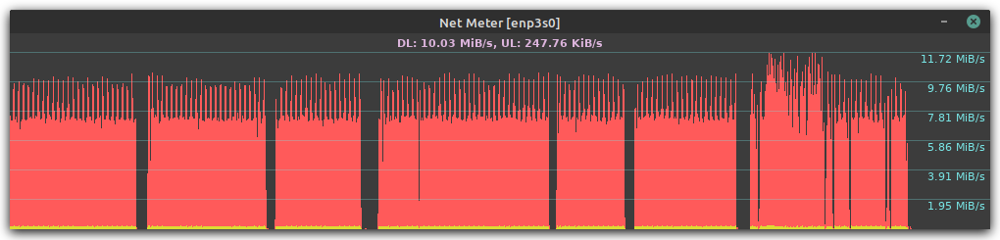

# Net Meter



A very minimalistic GUI for monitoring network traffic in a compact bar graph.
It shows data received (download) and transmitted (upload) in bytes per second.
By dragging mouse cursor on the graph, it can show you individual points in history.

## Usage
```
git clone https://github.com/TheYoke/netmeter.git
pip install -r netmeter/requirements.txt
# optionally, modify configurations in the top of "netmeter/__main__.py" file.
python -m netmeter NET_INTERFACE
```
where `NET_INTERFACE` in the last command is a name of the network interface to monitor.
(use `ifconfig` to find that)

---

This program is inspired by [Net Meter](http://www.hootech.com/NetMeter/) and [Speedometer](https://excess.org/speedometer/)
